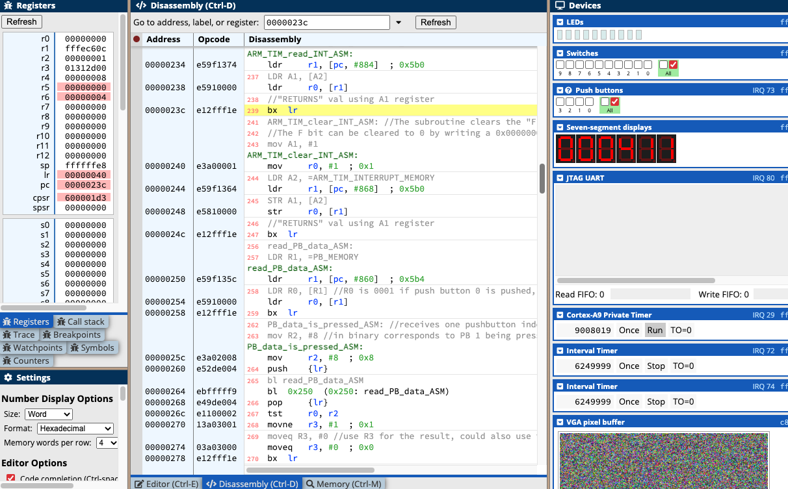

# Stopwatch

Stopwatch programmed in ARMv7 assembly.

## Run it for yourself!
Head over to [here](https://ecse324.ece.mcgill.ca/simulator/?sys=arm-de1soc) to try the stopwatch for yourself.
Copy the *stopwatch.asm* code into the emulator. Click *Compile and Load* then *Continue*

Click the *Push Buttons* 0, 1, and 2 to start, stop and reset the stopwatch, respectively.

